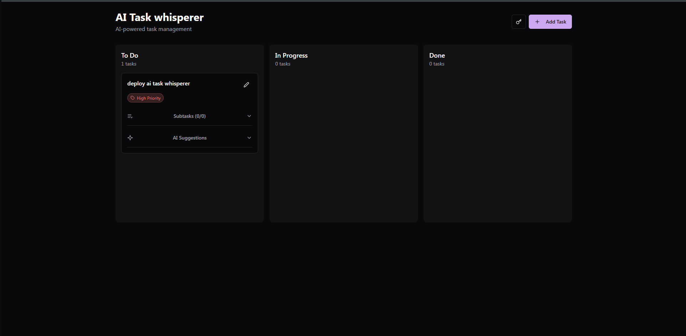

# 🧠 AI Task Whisperer

A simple and elegant todo app enhanced with an AI assistant that suggests ways to complete your tasks more efficiently.

---

## ✨ Features

- ✅ Add, edit, and delete tasks
- ✔️ Mark tasks as complete
- 🤖 AI-powered suggestions for task completion
- 📱 Responsive design for all devices

---

## 🛠️ Technologies Used

- [Vite](https://vitejs.dev/)
- [TypeScript](https://www.typescriptlang.org/)
- [React](https://react.dev/)
- [shadcn/ui](https://ui.shadcn.com/)
- [Tailwind CSS](https://tailwindcss.com/)

---

## 🚀 Setup Instructions

### Prerequisites

Ensure you have the following installed:

- [Node.js & npm](https://nodejs.org/)  
  (We recommend using [nvm](https://github.com/nvm-sh/nvm) to manage Node versions)

### Getting Started

```bash
# 1. Clone the repository
git clone https://github.com/Weskio/ai_task-whisperer

# 2. Navigate into the project
cd ai_task-whisperer

# 3. Install dependencies
npm install

# 4. Start the development server
npm run dev
````

Open your browser and go to:
🔗 **[http://localhost:8080](http://localhost:8080)**

---

## 🌐 Deployment

To deploy on platforms like **Vercel** or **Netlify**:

```bash
# Build the project
npm run build
```

Deploy the contents of the `dist` folder.

For custom domain setup, refer to your hosting provider’s documentation.

---

## 🖼️ Screenshot



---

## 🤝 Contributing

Contributions are welcome! Here's how you can help:

1. **Fork the repository**
2. **Create a feature branch** (`git checkout -b feature/YourFeature`)
3. **Commit your changes** (`git commit -m "Add new feature"`)
4. **Push to your fork** (`git push origin feature/YourFeature`)
5. **Create a Pull Request**

Make sure your code follows the existing style and includes relevant updates to the README or docs if needed.

---

## 📄 License

This project is open source and available under the [MIT License](LICENSE).

---

Made with ❤️ by [@Weskio](https://github.com/Weskio)

```

Let me know if you'd like to auto-generate badges for build status, license, or add a Code of Conduct file.
```
